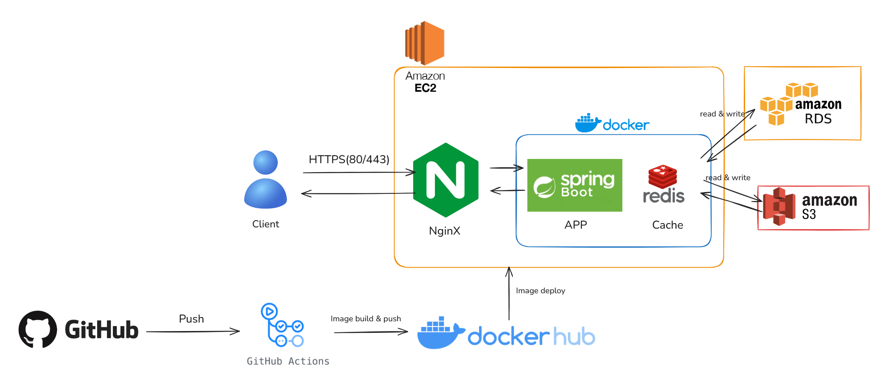

# 🦎  MOAMOA Backend

--- 


## 🚀 서비스 소개

---

## 👨‍💻 Team MoaMoa

| 미카엘 (한민재) |                         준 (박영준)                          |                         배민 (배민규)                         | 제로 (김신영) |                        박콩 (박해원)                         |
| :---: |:--------------------------------------------------------:|:--------------------------------------------------------:| :---: |:-------------------------------------------------------:|
|  |  |  |  |  |
| **Cloud & Infra** |                    **Auth & Policy**                     |                  **Inquiry & My space**                  | **Item & Onboarding** |                       **Mission**                       |
| [@minjaehan](https://github.com/minjaehan) |        [@YoungJJun](https://github.com/YoungJJun)        |        [@mingyu210](https://github.com/mingyu210)        | [@ZeroColaa](https://github.com/ZeroColaa) |        [@haewonee](https://github.com/haewonee)         |

---

📌 **미카엘/한민재**

- 담당: Cloud Engineering, Infra
- [tommy3942@naver.com](mailto:tommy3942@naver.com)
- https://github.com/minjaehan
- 010-2025-2037

📌 **준/박영준**

- 담당: 로그인 관련 API
    - 회원가입 및 탈퇴, 로그인
    - 약관 조회, 동의, 갱신
    - 회원정보 수정
- [young_879@naver.com](mailto:young_879@naver.com)
- https://github.com/YoungJJun
- 010-8290-2699

📌 **배민/배민규**

- 담당: 도토리 조회, 출석체크, 스페이스 달력
- [abba210@naver.com](mailto:abba210@naver.com)
- https://github.com/mingyu210
- 010-5545-0543

📌 **제로/김신영**

- 아이템, 온보딩 관련 api
- [sinyoung556@gmail.com](mailto:sinyoung556@gmail.com)
- https://github.com/ZeroColaa
- 010-3541-7078


📌 **박콩/박해원**

- 담당: 미션 관련 API
- [godnjs5870@naver.com](mailto:godnjs5870@naver.com)
- https://github.com/haewonee
- 010-2772-5870


---

## 🛠 기술 스택

### Backend
- Java 21
- Spring Boot
- Spring Data JPA
- QueryDSL
- Spring Security
- Gradle (Groovy)
- Lombok

### Database & Cache
- MySQL
- Amazon RDS
- Redis

### Database Migration
- Flyway

### Storage
- Amazon S3

### Infrastructure / DevOps
- Amazon EC2
- Docker
- GitHub Actions (CI/CD)

### API & Documentation
- Swagger (OpenAPI)

---


## 📌 주요 기능


---

## 📂 프로젝트 구조

### 도메인 중심 패키지 구조
각 도메인 별로 관리하여 유지보수와 테스크에 용이합니다.
```
src/main/java/com/example/app
├── global                      # 전역 공통 모듈
│   ├── config                  # 설정 관련 클래스
│   │   ├── SecurityConfig.java
│   │   ├── SwaggerConfig.java
│   │   └── WebConfig.java
│   ├── error                   # 전역 예외 처리
│   │   ├── ErrorCode.java
│   │   ├── GlobalExceptionHandler.java
│   │   └── CustomException.java
│   ├── response                # 공통 응답 포맷
│   │   └── ApiResponse.java
│   └── util                    # 유틸리티 클래스
│       └── JwtUtil.java
│
├── domain
│    └─ member                        # 회원 도메인
│       ├── controller              # 회원 관련 API
│       │   └── MemberController.java
│       ├── service                 # 회원 비즈니스 로직
│       │   └── MemberService.java
│       ├── repository              # 회원 데이터 접근 계층
│       │   └── MemberRepository.java
│       ├── entity                  # 회원 엔티티
│       │   └── Member.java
│       ├── dto                     # 회원 DTO
│       │   ├── request
│       │   │   └── MemberSignupRequest.java
│       │   └── response
│       │       └── MemberResponse.java
│       └── exception               # 회원 도메인 예외
│           └── MemberException.java
│               
│               ...
│
└── Application.java             # Spring Boot 실행 클래스

```
---

## 🌐 서비스 아키텍쳐


--- 


## 🧾 개발 컨벤션
아래 문서를 기준으로 네이밍/협업 규칙을 통일합니다.

[](docs/conventions/github-rule.md)

[](docs/conventions/method-naming.md)

[](docs/conventions/class-naming.md)

[](docs/conventions/field-naming.md)


---

## 🌱 브랜치 전략 & 커밋 컨벤션

브랜치/커밋/PR/리뷰 규칙은 아래 문서를 기준으로 운영합니다.
- 👉 [GitHub 협업 규칙 문서](docs/conventions/github-rule.md)

### 요약
- **Branch**: `develop`에서 작업 브랜치 생성 → 작업 후 `develop`으로 PR
  - `main`: 배포 브랜치(PR로만 병합)
  - `hotfix/*`: 운영 긴급 수정(`main` → `develop` 반영 필수)

- **Branch naming**: `type/work-desc/#issue-number`
  - 예) `feat/login/#12`, `docs/conventions/#19`

- **Commit**: `type: subject` (type는 소문자)
  - 예) `feat: ...`, `docs: ...`

- **PR / Issue 제목**: `[Type] 작업 요약`
  - 예) `[Feat] ...`, `[Docs] ...`

- **이슈 자동 종료**: PR 본문에 `Closes #이슈번호`
